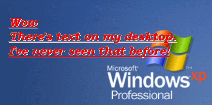



## Desktop Messages \- Transparent \(Beta dll\)

### Description

Check out the Screen Shot! I dont recall seeing this before. Takes Evan's idea a step further with transparent background, although the code is nothing alike!
 
### More Info
 

             |
---                |---
**Submitted On**   |2004-04-28 15:21:26
**By**             |[Peter\.](https://github.com/Planet-Source-Code/PSCIndex/blob/master/ByAuthor/peter.md)
**Level**          |Intermediate
**User Rating**    |4.8 (38 globes from 8 users)
**Compatibility**  |VB 5\.0, VB 6\.0
**Category**       |[Custom Controls/ Forms/  Menus](https://github.com/Planet-Source-Code/PSCIndex/blob/master/ByCategory/custom-controls-forms-menus__1-4.md)
**World**          |[Visual Basic](https://github.com/Planet-Source-Code/PSCIndex/blob/master/ByWorld/visual-basic.md)
**Archive File**   |[Desktop\_Me174040532004\.zip](https://github.com/Planet-Source-Code/peter-desktop-messages-transparent-beta-dll__1-53440/archive/master.zip)

